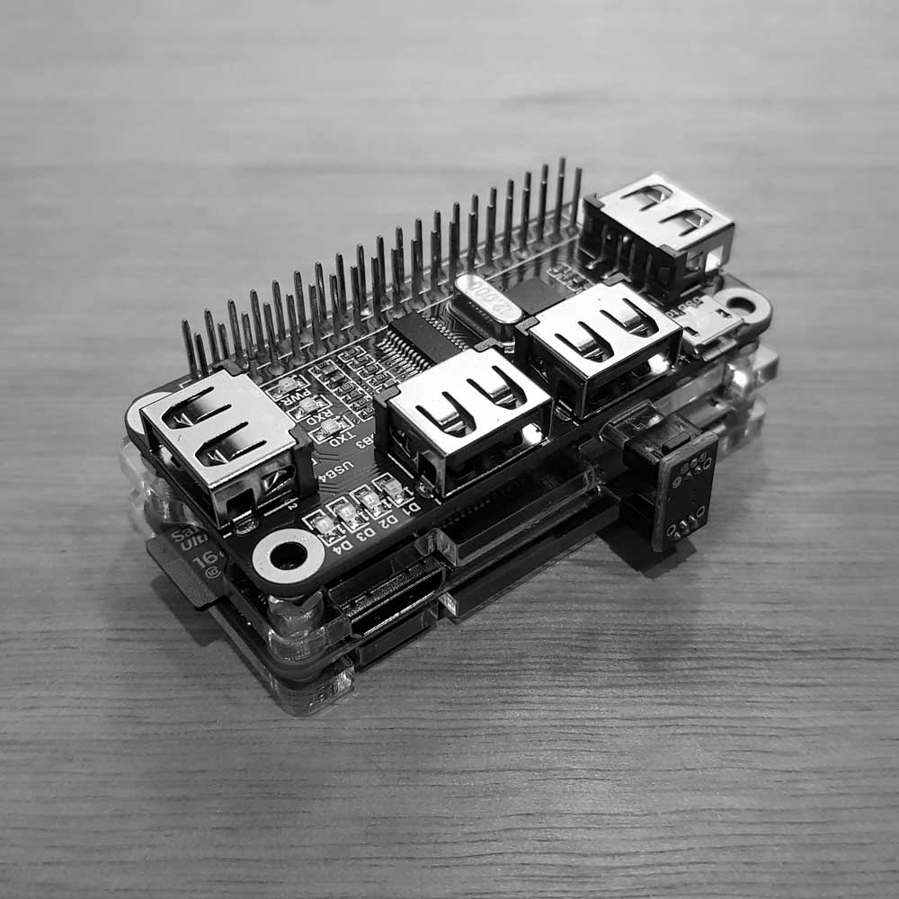

**VNS CORE**

Node.js app running on Raspberry Pi Zero W

Receives input from web UI and/or [CONTROL](https://github.com/kormyen/VNS/tree/master/CONTROL) panel(s), sends commands to [POWER](https://github.com/kormyen/VNS/tree/master/POWER)



#### Development
```
git clone git@github.com:kormyen/vns.git
cd vns/CORE
npm install
npm start
```
Then visit http://localhost:3000/
___

#### Setup
[Raspberry Pi Zero W + VNS CORE service Setup Guide](SETUP.md)
___

#### Dependencies

- OS: [Raspbian Lite](https://www.raspberrypi.org/downloads/raspbian/)
- Runtime: [Node.js](https://nodejs.org/en/)
- Runtime: [Node.js](https://nodejs.org/en/)
- Web UI: [Express](https://expressjs.com/)
- State sync: [Socket.io](https://socket.io/)
- Arduino communication: [Serialport](https://node-serialport.github.io/node-serialport/)
___

#### Parts

- [Raspberry Pi Zero W](https://shop.pimoroni.com/products/raspberry-pi-zero-w)
- [4 port USB Hub Hat](https://www.aliexpress.com/item/4-Ports-USB-HUB-HAT-for-Raspberry-Pi-3-2-Zero-W-Extension-Board-USB-to/32826308506.html)
- [Acrylic Case](https://www.aliexpress.com/item/Raspberry-Pi-Zero-W-Case-Acrylic-Case-Black-Aluminum-Heat-Sink-Transparent-Box-compatible-for-Raspberry/32796224314.html)
- [Mini-HDMI to HDMI cable](https://www.aliexpress.com/item/High-speed-Gold-Plated-HDMI-TO-MINI-HDMI-Plug-Male-Male-HDMI-Cable-1M-2M-3M/32840949844.html)
- [64GB U3 Micro SD](https://www.aliexpress.com/item/SAMSUNG-Memory-Card-Micro-SD-256GB-16GB-32GB-64GB-128GB-SDHC-SDXC-Grade-EVO-Class-10/32610125064.html)