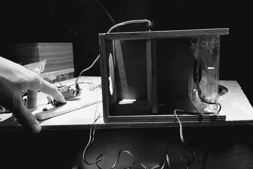

**VNS FAN**

Prototype phase.

- air sealed fan box
- outlet/inlet to outside
- outlet/inlet to inside
- servo controlled hatch door to stop breeze/airflow (contain heat in cold env)
- fan speed control (low/high speed at minimum, variable speed nice)
- fan direction control ideal

